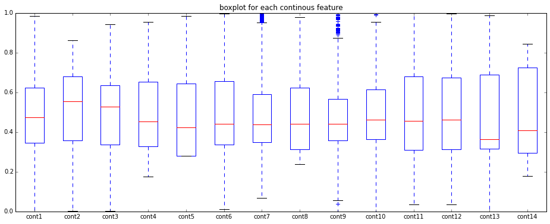
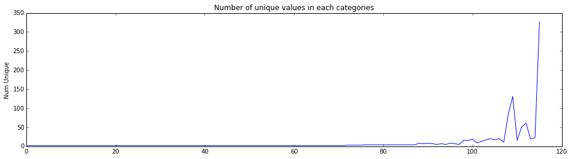
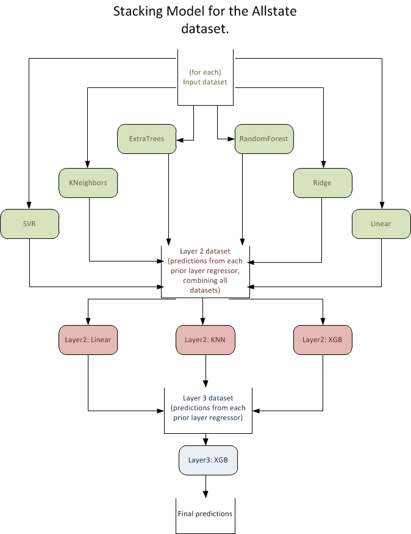
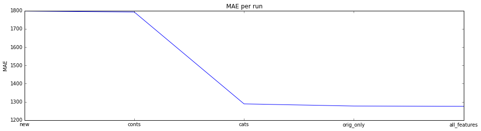
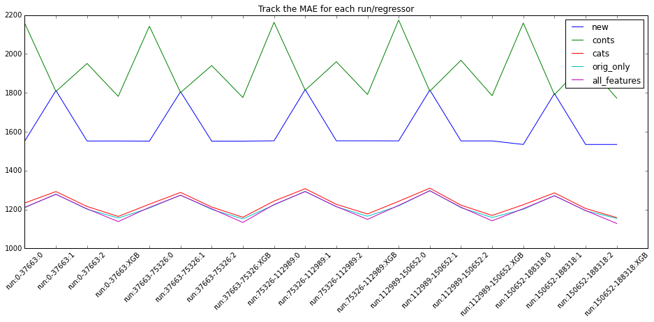
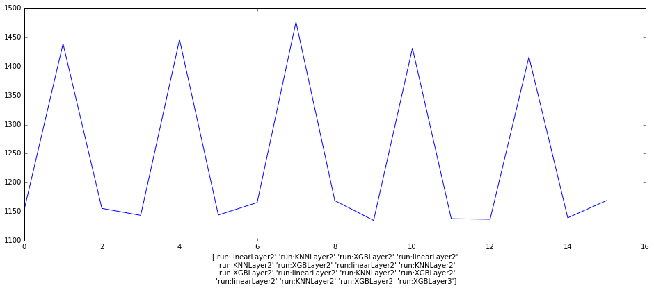

# Machine Learning Engineer Nanodegree
## Capstone Project
Bryan Luke Lathrop - March 10th, 2017

## I. Definition

### Project Overview

This project is based around the Kaggle competition detailed at: [Allstate-Claims-Severity](https://www.kaggle.com/c/allstate-claims-severity)

This competition centered on the idea that the severity(or cost) of a claim may be predicted based on the several factors in the data set. Much of the work in statistics to date has been used by the insurance industry in pursuit of this goal, and this particular challenge is aimed at recruiting the participants for work in an already tested field. 

I choose this competition as it dataset and goals allow us to explore various machine learning techniques without focusing on data collection. I also believe that the techniques and goal used are very close in style to those used in industry currently, and so more applicable to future projects.

### Problem Statement

Using the provided dataset, we will use various machine learning techniques to predict the claims severity. The general type of techniques to be used is know as a "regression". Claim severity is expressed as a cost, where a higher cost is a higher severity. The predictions will be made on a per claim basis, and are intended to be applied to future claims as an indicator for customers/agents. The data does not provide a description of the features, and so we must use information analysis techniques to present a solution. 

To solve our problem, we will attempt to create a regression model that uses the features of the training data to make a prediction about claim severity, known as "loss". This model will then be used to make a prediction on the test sets. Our expected solution will use a technique known as "stacking" to combine the predictions of several standard regressors trained on variations of the data into a new data set. This new dataset will then be used with several new regressors to make predictions for a final layer, where once again a new regressor will be used to make a final prediction of loss. Stacking the models in this manner is expected to improve the score over any of the individual models abilities.

### Metrics

The project success may be evaluated on the improvement in score over the benchmark model, as returned from the competition. Both models will be trained using the same data and submitted for the same test data. As we are using [MAE](https://en.wikipedia.org/wiki/Mean_absolute_error) for scoring, we will be looking for the lowest score as the winner. Since we can't verify the test set directly, we will further break out a validation set from the train data, for use as our own test set for the purpose of validating the models before use with the provided test set. This validation set will be sized to about 20% of the train data.

[MAE](https://en.wikipedia.org/wiki/Mean_absolute_error) score is defined as the mean of the absolute value of the real minus predicted values of each row in the validation/test data sets: 1/n sum(abs(each_predicted_y-each_real_y))) The advantage of MAE (other than being a contest requirement) is that it provides a simple measurement of the error of a prediction that disregards the sign of the error and doesn't over-emphasize outliers. In our problem, we will generate MAE by inputing the prediction we make vs the known value of loss in the training set into the formula above.

Additionally, we will review prediction time for the scores achieved, as well as training time, in an effort to quantify the effort needed to use the score in a production environment. These times will be used with the final scores to determine viability of the model

## II. Analysis

### Data Exploration

The dataset is provided by the competition organizer, and is anonymized, including removing labels from each data point. We are to assume that this data was gathered in the normal course of the business of prior insurance claims, and will be continue to be gathered so that new predictions may be made. This means that we may not use intuition to provide new features. We are to assume that the data is relevant to the problem and accurate. We may test this relevance*, or use methods such as PCA to examine the most relevant labels*.

We are provided training and test data set, where the training set includes the "loss" field that we are attempting to predict, and test does not. When looking at the common features, we see 116 categorical and 14 continuous features. The features seem well matched between train and test, with similar mean/standard deviation/min/max. The train set has 188318 rows, and the test set has 125546. Average loss is 3037.3376

**Data sample:**

|   |id  |cat1|cat2|cat3|cat4|cat5|cat6|cat7|cat8|cat9|....|cont6|cont7|cont8|cont9|cont10|cont11|cont12|cont13|cont14|loss|
| ---|:---|:---|:---|:---|:---|:---|:---|:---|:---|:---|:---|:----|:----|:----|:-----|:-----|:-----|:-----|:-----|:----|:---|
|0 |	1|A|B|A|B|A|A|A|A|B|...|0.718367|0.335060|0.30260|0.67135|0.83510|0.569745|0.594646|0.822493|0.714843|2213.18|
|1	| 2|A|B|A|A|A|A|A|A|B|...|.438917|0.436585|0.60087|0.35127|0.43919|0.338312|0.366307|0.611431|0.304496|1283.60|
|2	| 5|A|B|A|A|B|A|A|A|B|...|.289648|0.315545|0.27320|0.26076|0.32446|0.381398|0.373424|0.195709|0.774425|3005.09|
|3	| 10|B|B|A|B|A|A|A|A|B|...|.440945|0.391128|0.31796|0.32128|0.44467|.327915|0.321570|0.605077|0.602642|939.85|
|4	| 11|A|B|A|B|A|A|A|A|B|...|0.178193|0.247408|0.24564|0.22089|0.21230|0.204687|0.202213|0.246011|0.432606|2763.85|

### Exploratory Visualization

Here we can see a box plot of the conts values, showing that they are all close in value, but that a few do have outliers:

And we see that the in the categorical features, we see that many features have limited variation, but still a significant number have a many answers, and a few that have a relative large number of answers:

For more stats and visualizations see: [DataExploration.ipynb](https://github.com/llathrop/udacity-ML-capstone-Kaggle-Allstate/blob/master/DataExploration.ipynb)

### Algorithms and Techniques

We will use various pre-processing techniques to generate new features and otherwise prepare the data. Following this we will use various SKLearn regressors, optimized with grid search, and XGBoost to generate the first layer of an ensemble model using stacking. The following layers will use similar regressions on the output of the prior layers, with the final layer providing a final prediction for each input.

The model will output a predicted 'loss' for each claim in the validation data. Once trained and satisfactory scores are obtained with the validation data, the model will be retrained on the full data set and predictions made on the test data. The result will then be submitted to the Kaggle competition, where a score will be assigned to the model. The solutions score will be evaluated using the mean absolute error(MAE) between the actual and predicted loss.

*  [Scikit-learn](http://scikit-learn.org/): A well-regarded tool kit for Machine Learning, we will use several regressors from here to make predictions. some examples are:
   * Linear - The standard for all regression tasks, it attempts to fit a line to a dataset
   * Ridge - a Linear least squares with l2 regularization
   * RandomForestRegressor -an ensemble method, creates a decision tree drawn on subsets of the features(with replacement)
   * ExtraTreesRegressor - similar to RandomForestRegressor, with an extra layer of randomness in how each split in the tree is created
   * KNeighborsRegressor - uses the nearest neigbors to make the prediction
   * SVR - a libsvm based estimator that uses a seperating hyperplain to make it's prediction
*  [XGBoost](http://xgboost.readthedocs.io/): A powerful variant of gradient boosted trees. We will use this as an additional regressor, similar to the ones from scikit-learn,
*  [Stacking](https://en.wikipedia.org/wiki/Ensemble_learning#Stacking): a method where in the predictions from several models are combined and used as the input to a new model, used to make a final prediction

### Benchmark

The benchmark model for this project is a simple linear regression based on the data, with the same pre-processing, and run first with the initial data minus a validation set and once scoring appropriately, submitted for scoring according to the previously mentioned method. This will provide a definitive measurement of the improvement we see in the final model. We'll also run the benchmark against the various datasets created during pre-processing, to demonstrate the effects it has, and that this didn't create a benchmark better that the final model. In other words we will demonstrate that the score improvement is of the final model is not due to pre-processing.

## III. Methodology

### Data Preprocessing
To prepare the data, several tasks take place

* The train/validation and test data from the contests is combined
* Categorical data is be transformed to numerical (see LabelEncoder() function), using factorize
* All data is MinMax scaled, 0-1, using the SKLearn MinMaxScaler()
* Unneeded features will be removed(ex:id)

additionally:
* new features will be created:
    * clusters for each row, for just continuous features, for just categorical. Clusters are computed by first taking a subset of the      data and calculating the Kmeans cluster for each, with startingClusterSize=int(len(data)*.075). The cluster centers for this are        then used to calculate the number of actual clusters with Meanshift(). Kmeans is then re-run again using this number of clusters.        This is done to provide a significant performance boost over using either one on it's own. The final cluster # is scaled 0-1, to         better fit with regressors that prefer it see: [on-mean-shift-and-k-means-clustering](http://jamesxli.blogspot.com/2012/03/on-mean-shift-and-k-means-clustering.html)
    * various features may be modified due to relevance.
* features will be analyzed for relevance using PCA(FIXME)

The benchmark model will be trained and tested with and with out these added features:
* the data is split back into original train/validation and test segments
* datasets based on subsets of the features: new, conts, cats, orig_only,all_features are generated for each segment needed
* all dataset's are preserved for use.

for details, please review: [preprocess_data.ipynb](https://github.com/llathrop/udacity-ML-capstone-Kaggle-Allstate/blob/master/preprocess_data.ipynb)

### Implementation

The project is implemented as a series of Jupyter notebooks, intended to be run in order, and using cached data if available.

#### [preprocess_data.ipynb](https://github.com/llathrop/udacity-ML-capstone-Kaggle-Allstate/blob/master/preprocess_data.ipynb): 

As mentioned above, will take the raw data and generate the data mentioned in the preprocessing section

#### [JustStacking-Layer1.ipynb](https://github.com/llathrop/udacity-ML-capstone-Kaggle-Allstate/blob/master/JustStacking-Layer1.ipynb):

Taking the data from preprocessing, we use each data set and first pick several SKLearn regressors, and combine them into a list for ease of use, along with several parameter/values dicts for use in grid search. We'll then split the provided train dataset into a new train and validation sets, for use in par(80/20 split). Using the new train data, we will run a grid search for each of the selected models, creating a list of regressors with parameters set from the search, and saved to disk for ease of reuse.

We'll follow this by using xgb.cv() to find the best n_rounds for a set of parameters that have been manually selected and experimentally optimized. The train and validation sets are discarded, as we will now work split the entire train set into k-folds(K=5) for the first layer.

For each fold we will use the current fold as the test set and train(or fit) the model on the rest of the data, x, making a prediction, y. The prediction for each fold will be made for each of the regressors that we have selected. The predictions for each fold will then be stacked together for use in the next layer. MAE (Mean Absolute Error) is logged so that we may track progress.

After the predictions are made for the first layer, they are averaged and a cluster is predicted and both added as a feature to the layer. Due to run time, first layer models are saved and loaded if present.

Predictions are made at this stage for the test and validation set first layer also, and preserved.

#### [JustStacking.ipynb](https://github.com/llathrop/udacity-ML-capstone-Kaggle-Allstate/blob/master/JustStacking.ipynb):

The same process is followed for layer two, but with input data being the predictions from the first layer. Following some setup of variables, etc, We choose if this run will be for the validation data, or for the competition test set. We load the data from the first layer for that dataset, and first set up a grid search for best hyper-parameters for the regressors chosen for layer 2. Again, XGB follows a different structure, and is done separatly. Cached results are used if appropriate in the grid search.

Following this, we again make predictions via folding, as above, but training and predicting the new models on the predictions from the first layer models. We also track the MAE per run again, to track progress. While the average value of the 2nd layer predictions was found to add value, clusters were not at this layer. The predictions from the 2nd layer are then fed to a final regressor for our final train/predict cycle.

We may now begin the next layer. At this point, we no longer need to use the folds, as the predictions are not needed for another layer. we instead use a standard test/train split, only so that we may evaluate performance of the model. model fit and prediction proceed as normal.

We now take the models built for layer 2 and 3, and use them to make predictions on the test data. It was found experimentally that the third layer predictions did not add value, but they have been left in as an example. The results of these final predictions are preserved and the competition  set may at this point be submitted.

This notebook is run twice, once for the validation set, and again if the competition submission is needed. The switch is made (if needed) by choosing the dataset in the setup section.

* Please note that run time of layer1 and preprocessing may be prohibitive. To save time, download each of: [data](https://drive.google.com/open?id=0B6nundNlo3spWFNKRmZ3YjJUckE)/[cache](https://drive.google.com/open?id=0B6nundNlo3spNVJsSVRqTnJEQ0U)/[output](https://drive.google.com/open?id=0B6nundNlo3spMTlwd3hEQ0NQWEk), and unzip to the top level directory of the project. 

### Refinement

Each regression was found to need individual tuning to achieve results, but as we were focused on the final output of the stack, more time was spent refining the stacking techniques. It was found that due to the run time of the full model, especially operations like grid search, caching and re-use of the results was perhaps the most important step in the process, with each stage being broken out and and intermediate output of stages being preserved for later use.

At each stage of the process, it was found helpful to provide intermediate results, to ensure that progress has been made. These are preserved in the files above for ease of retrieval in the future

The base technique of stacking was further refined by adding features via other methods, such as averaging and clustering the results of stage 1 models. Each of these was found to result in a small improvement in final score.

After the initial version of stacking with linear/xgb/ExtraTreesRegressor as the layer 1 models, the largest improvement was found by adding additional models and using them with each variant of the data.

## IV. Results

### Model Evaluation and Validation

The final model is found to provide results inline with any individual regressor for the data. It should be able to withstand input  collected in the same manner, and in fact saw reasonable results when submitted to the competition, falling in the upper third of results, for both public and private Kaggle data sets(Note: the public set is used for testing until the contest concludes, upon which the private set is used to judge scores). It was seen that across all data sets (Validation/Train/Test), the results were similar for similar inputs. It should be considered that this process can add prohibitive time to the process, especially in the training stage.

### Justification

In the end we have seen that using stacking to combine the results of models has made a significant improvement in scores as compared to the base output of the linear model. This shows that for the type of problem, stacking is a very valid way to arrive at a more accurate solution. 

In our Linear regression benchmark against the full train data we see and an MAE of 1288 for the original data set and 1287 for the data with new features.

In our stacked regression against all train data and the combined datasets we see  an MAE of 1132. It was seen that adding a further layer beyond the 2nd didn't contribute to a better score, and as such the best scoring regressor from layer 2 was used for the results and submission to contest 

These scores were also validated via submission to Kaggle. For the linear set, the best score were:(Private)1272.27333, (Public)1264.60772. For the Stacked set, the best score was: (Private)1132.97728, (Public)1119.72524. These match well with our validation set and training set scores.

Using these numbers we can see an approximately  11-12% improvement in score over our benchmark, and a 7% improvement over the best regressor score seen in layer 1.

## V. Conclusion

### Free-Form Visualization

The goal of the project was to show the benefit of combining models. We can see this by taking a look at these results, and comparing lowest MAE.

First we see the results with a standard Linear regression. Results are shown for each dataset so that we can see the different scores. We can clearly see that adding data give a better score, and although harder to see, that the created features improved the score

Next we have a look at results of each fold, for each of the regressors used...This is roughly equivalent  to how they would perform without further stacking. We again see the improvement  of more data, and we can also see that XGB gives the lowest score of any regressor we have tried.

And finally, a look at each fold as we run through layer 2 & 3. We can see that we actually get a better score in layer 2, using a linear regression on the results from the first layer. Using this it was determined that adding layer 3 did not contribute to the final product, and in the end the best submission was based on the linear regression from layer 2.

### Reflection

In this project we have demonstrated the benefits of stacking several models to improve the final score, which also demonstrated the effectiveness  of the individual models. The individual models were optimized via methods such as grid-search and then fit to various pre-processed datasets. The predictions of these models were then "stacked" and a further model was optimized  and fit to the new data.

While the improvement in score from the stacking was interesting, I found the optimization of each model in layer 1 to be the more interesting portion of the project. Although this tuning didn't allow a model to go below the stacked score, it would in-turn drop the final stacked score by several points.

The project presented several challenges, namely automating the training/prediction of several different models, and minimizing time spent. Each model required different tuning and some organization was required to allow for that. One model(XGB), was not able to easily be matched to the style of the others, and had to be dealt with as an exception.

In addition, many of the models have relatively  long training/prediction times. This affects the project in several places, as training/prediction is a natural part of hyper-parameter optimization, and we used many different data sets. Although a full timing was never conducted, I would estimate that on the hardware I used (32-core Google Cloud - Compute Engine), to regenerate my results would take in the area of a week. To mitigate this, I cached various results, and loaded them if present.

In the end, I believe that the project accomplished my goal of demonstrating various machine learning strategies, and the effectiveness  of the stacking method. Specifically, Stacking seems to be one method that should be used in general practice, when an improvement in score may not be possible from using a single model.

### Improvement

To further improve the project implementation, we would  approach three basic areas:
* Notebooks:
   The project evolved as a series of jupyter notebooks, and remained that way throughout implementation. While a wonderful way to iterate code, it does not lend itself to repeat or automated use. A first, simple way to improve the project is to move most or all of the code into regular python scripts, and break some of the widely used and copied portions off into their own libraries
* Code organization/re-factor:
   Related to the codes evolution as a notebook, significant re-factoring of the code would be suggested to allow for improved readability/maintainability. Especially related to the fit and predict aspects, which could be moved into a new class that might take a data set in and fit it to each of the models, predict, etc.
   
*However, most benefits to the score performance would be achieved  by:*   

* More models!:
   By adding even more models to the first layer we would expect to see our best performance improvement in score. Improvements are likely to be seen even by using similar models, but fit with different hyper-parameters, such that they respond to different aspects of the data. This project followed guidelines from a Kaggle competition, and the winners of the competition used in the area of 80 or more models, fit to the data with and without additional generated features. 
   
I think that it's clear that while this implementation is an improvement over the benchmark chosen, further improvement is firmly within reach by addressing the areas mentioned above.

-----------
